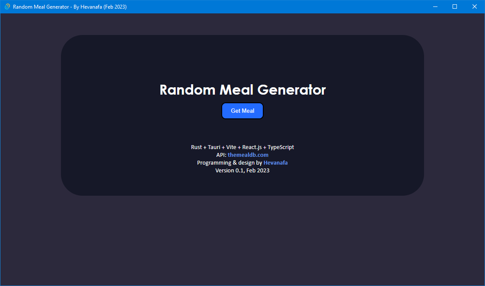
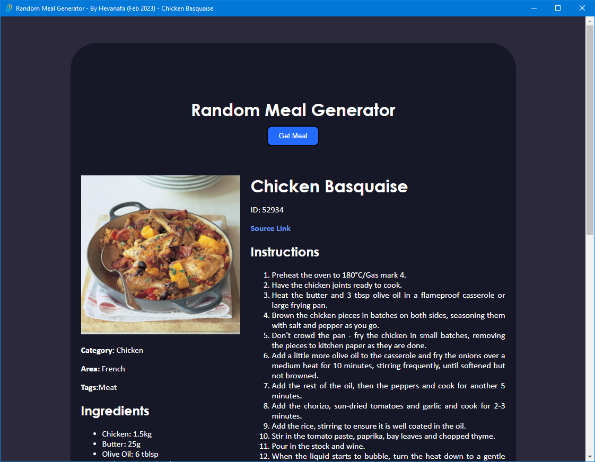

# Random Meal Generator

The idea is from https://www.florin-pop.com/blog/2019/09/100-days-100-projects/

I made the design, based on some showcase on Dribbble.

## Installation

```powershell
npm i -g pnpm
pnpm i
```

## Development

`pnpm tauri dev`

## Building

### Release

`pnpm tauri build`

### Debug

`pnpm tauri build --debug`

## Recommended IDE Setup

- [VS Code](https://code.visualstudio.com/) + [Tauri](https://marketplace.visualstudio.com/items?itemName=tauri-apps.tauri-vscode) + [rust-analyzer](https://marketplace.visualstudio.com/items?itemName=rust-lang.rust-analyzer)

## Preview Images




